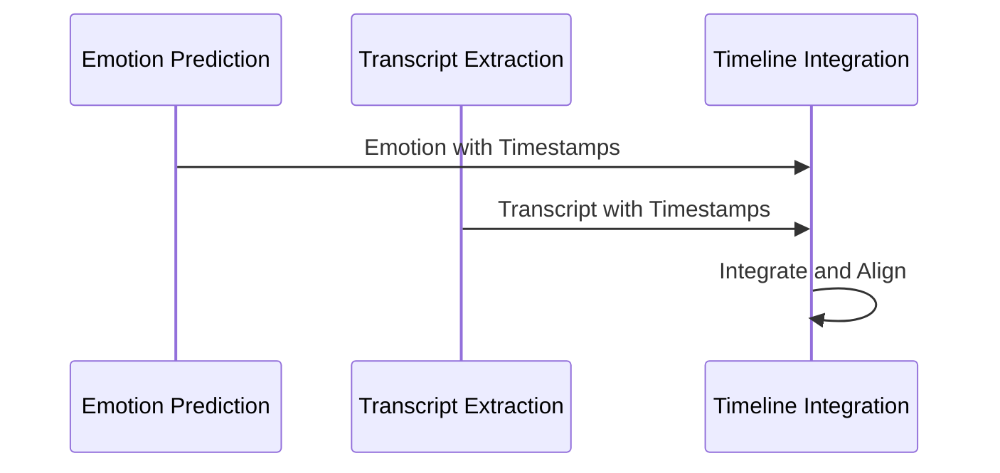
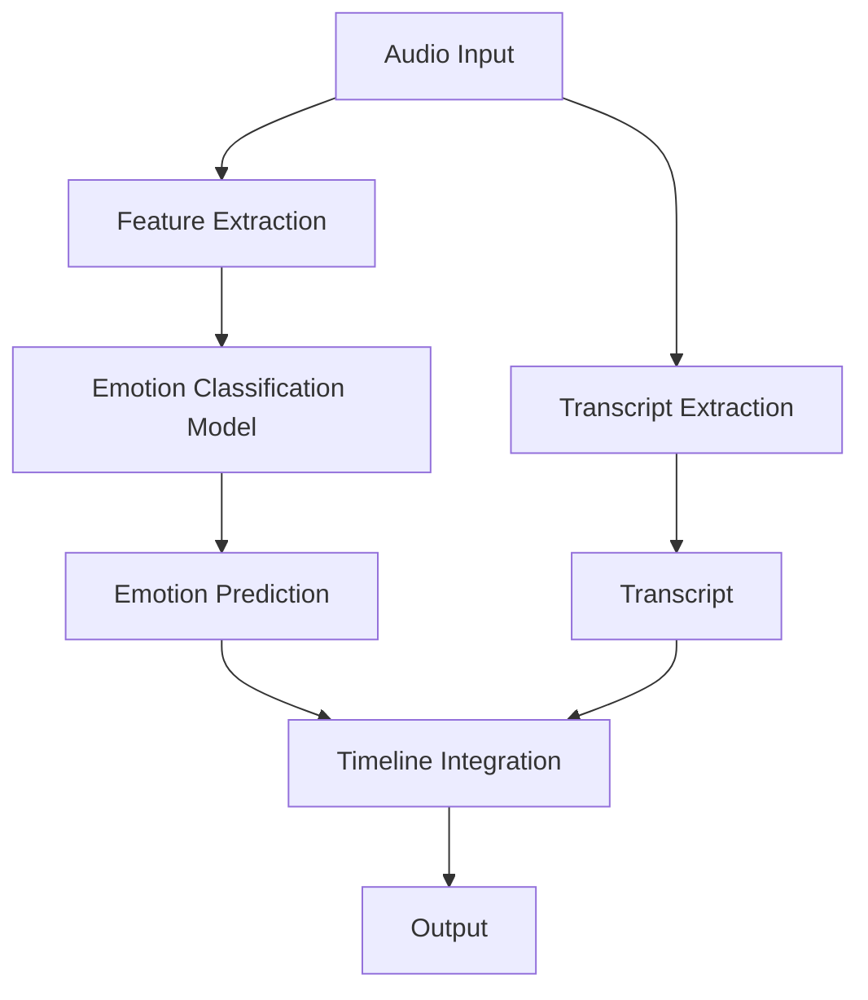
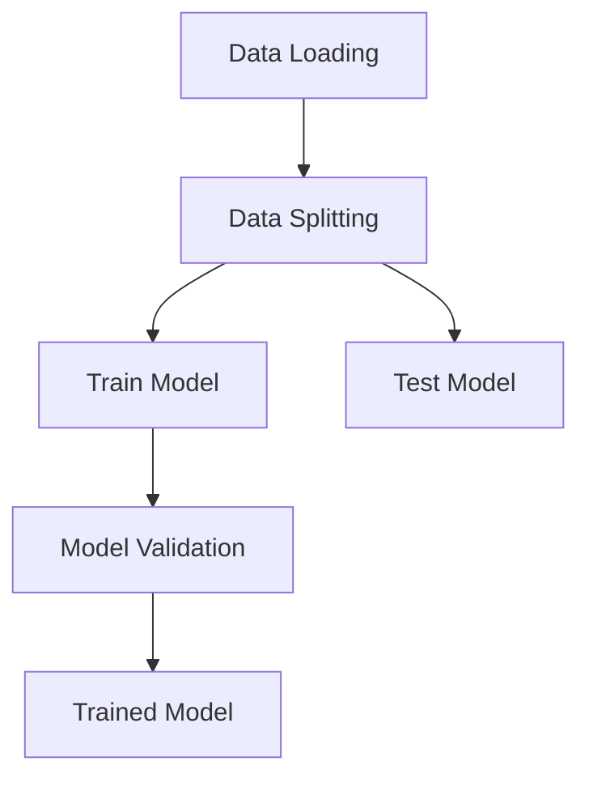
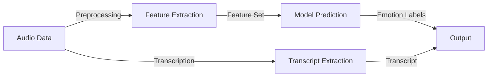
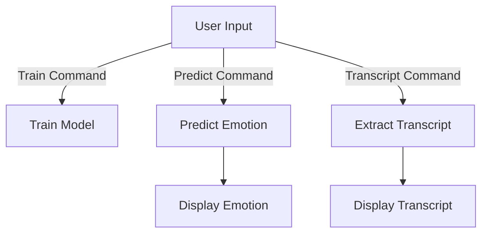

<div align="center">
    
</div>


# Speech Emotion Recognition (SER)
[](https://github.com/jsugg/ser/actions/workflows/ci.yml)
[](https://github.com/jsugg/ser/blob/main/pyproject.toml)
[](https://pypi.org/project/ser/)
[](https://opensource.org/license/mit)
---
## Overview
The `ser` package is a Python package designed to identify and analyze emotions from spoken language. Utilizing cutting-edge machine learning techniques and audio processing algorithms, this package classifies emotions in speech, providing insights into the emotional states conveyed in audio recordings.



### Features
- **Emotion Classification Model**: Trains on a dataset of audio files for accurate emotion recognition.
- **Emotion Prediction**: Predicts emotions from provided audio files.
- **Transcript Extraction**: Extracts a transcript of spoken words in the audio file.
- **Timeline Integration**: Builds a comprehensive timeline integrating recognized emotions with the corresponding transcript.
- **CLI Interface**: Offers command-line options for user interaction.
-------
### Workflows and architectures


-------

## Installation

```bash
git clone https://github.com/jsugg/ser/
cd ser
uv python install 3.12
uv sync --python 3.12
```

### Compatibility
- Supported Python versions: `3.12` and `3.13`
- Intel macOS (`x86_64`): use `3.12` (PyTorch wheels for `3.13` are not available)

-----
## Usage
------
### Training the Model
To train the emotion classification model:

```bash
uv run ser --train
```
This generates `ser/models/ser_model.pkl` locally. The model artifact is intentionally not tracked in Git.

-------
### Predicting Emotions
To predict emotions in an audio file:

```bash
uv run ser --file audio.mp3
```


-------
### Additional Options
* Specify language: **`--language <language>`**
* Save transcript: **`--save_transcript`**

---
## Modules
* **`transcript_extractor`**: Extracts transcripts from audio files.
* **`audio_utils`**: Utilities for audio processing.
* **`feature_extractor`**: Extracts audio features for model training.
* **`emotion_model`**: Contains the emotion classification model.


---

## Configuration
Edit **`ser/config.py`** to modify default configurations, including model paths, dataset paths, and feature extraction settings.

---

## Contributing
Contributions to SER are welcome!

### Development Checks
```bash
uv sync --extra dev
uv run ruff check ser
uv run black --check ser
uv run isort --check-only ser
uv run mypy ser tests
uv run pyright ser tests
```

### Git Hooks
```bash
uv sync --extra dev
uv run pre-commit install
uv run pre-commit install --hook-type pre-push
```

---

## License
This project is licensed under the MIT License - see the `LICENSE.md` file for details.

---

## Acknowledgments
- **Libraries and Frameworks**: Special thanks to the developers and maintainers of `librosa`, `openai-whisper`, `stable-whisper`, `numpy`, `scikit-learn`, `soundfile`, `tqdm`, and for their invaluable tools that made this project possible.
- **Datasets**: Gratitude to the creators of the RAVDESS and Emo-DB datasets for providing high-quality audio data essential for training the models.
- **Inspirational Sources**: Inspired by [Models-based representations for speech emotion recognition](https://arxiv.org/abs/2311.00394)
