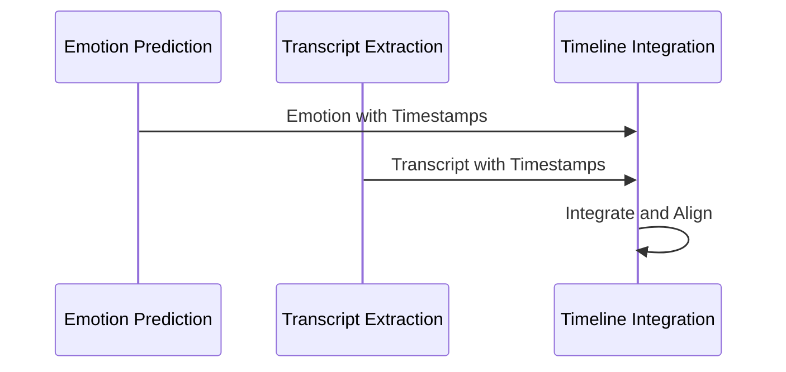
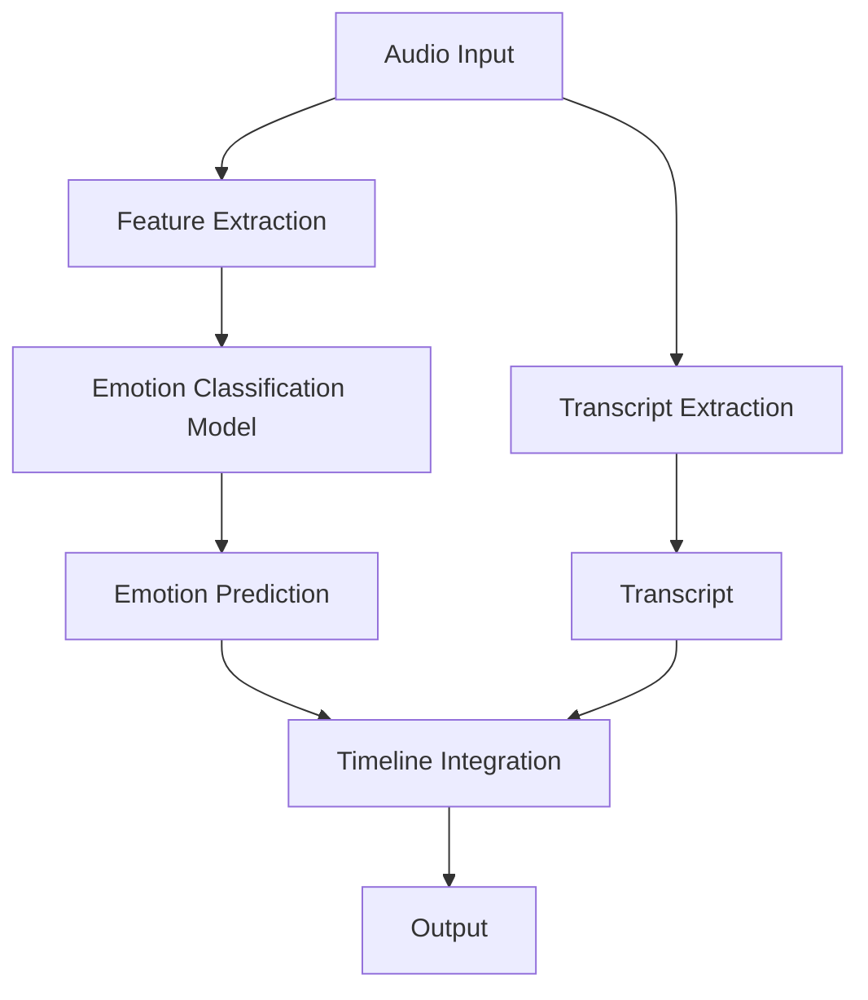
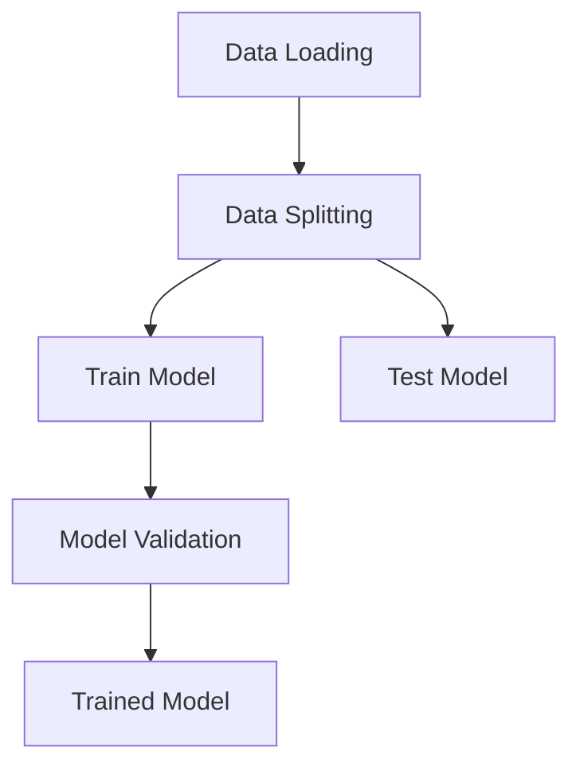
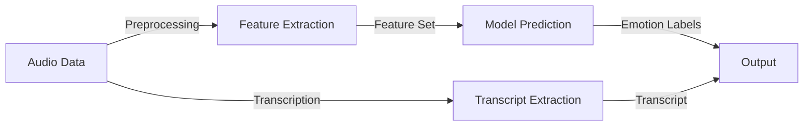
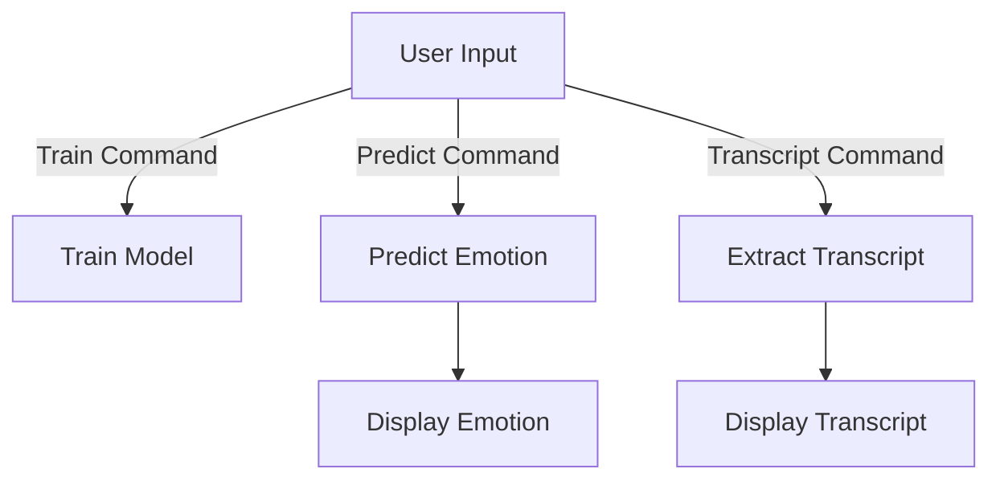

<div align="center">
    
</div>


# Speech Emotion Recognition (SER)
[](https://github.com/jsugg/ser/actions/workflows/ci.yml)
[](https://github.com/jsugg/ser/blob/main/pyproject.toml)
[](https://pypi.org/project/ser/)
[](https://opensource.org/license/mit)
---
## Overview
The `ser` package is a Python package designed to identify and analyze emotions from spoken language. Utilizing cutting-edge machine learning techniques and audio processing algorithms, this package classifies emotions in speech, providing insights into the emotional states conveyed in audio recordings.



### Features
- **Emotion Classification Model**: Trains on a dataset of audio files for accurate emotion recognition.
- **Emotion Prediction**: Predicts emotions from provided audio files.
- **Transcript Extraction**: Extracts a transcript of spoken words in the audio file.
- **Timeline Integration**: Builds a comprehensive timeline integrating recognized emotions with the corresponding transcript.
- **CLI Interface**: Offers command-line options for user interaction.

## Audience Guide
- **CLI users**: focus on `Installation`, `Usage`, and `Additional Options`.
- **Library users**: also review `Configuration` (common overrides first).
- **Contributors**: review `Contributing` and advanced sections in this README.
-------
### Workflows and architectures


-------

## Installation

### From PyPI (recommended)
```bash
python -m pip install ser
```

### From source (development)
```bash
git clone https://github.com/jsugg/ser/
cd ser
./scripts/setup_compatible_env.sh
```

### Compatibility
- Supported Python versions: `3.12` and `3.13`
- Runtime prerequisite: `ffmpeg` must be installed and available on `PATH`

<details>
<summary>Advanced compatibility/setup notes (library users and contributors)</summary>

- Intel macOS (`x86_64`) + Python `3.13` is currently **partial compatibility** (fast-profile oriented) and is **not** an officially supported full runtime lane.
- Intel macOS (`x86_64`) non-fast runtime (`medium`, `accurate`, `accurate-research`) depends on optional `torch`/`transformers` wheels that are not currently published for the platform tag in Python `3.13`; use Python `3.12` (or Linux `3.13` workflows) for those smoke paths.
- GitHub Darwin validation remains a Python `3.12` smoke lane (`.github/workflows/darwin-x86_64-validation.yml`) for hosted-runner parity.
- Non-fast profile predict paths (`medium`, `accurate`, `accurate-research`) require profile-compatible model artifacts; they fail closed on backend/profile metadata mismatch.
- `accurate-research` uses the FunASR/ModelScope `emotion2vec` runtime path and requires `--extra full`.
- Runtime policy: `fast` is the default profile. `medium`, `accurate`, and `accurate-research` remain opt-in lanes.

Current Darwin Intel policy shorthand:
`darwin-x86_64-macos13-python3.12` -> full-profile support.
`darwin-x86_64-macos13-python3.13` -> partial (fast-profile only), not officially supported as a full runtime lane.

Platform-aware setup overrides:
- `SER_SETUP_PYTHON` to force a specific Python version.
- `SER_SETUP_INCLUDE_DEV=false` to skip development tools.
- `SER_SETUP_CHECK_FFMPEG=false` to skip ffmpeg preflight.

</details>

-----
## Usage
------
### Training the Model
To train the emotion classification model:

```bash
uv run ser --train
uv run ser --train --profile medium
uv run ser --train --profile accurate
uv run ser --train --profile accurate-research
```
This generates compatibility model artifacts (`*.pkl` and optional `*.skops`) plus a
training report JSON under your configured models directory.
Profile-compatible artifacts are selected strictly during predict (fail-closed on mismatch).

<details>
<summary>Advanced artifact compatibility details</summary>

For non-fast profiles, default artifact filenames are keyed by `(profile, backend_model_id)`
to keep one artifact per backend model selection.

Profile artifact compatibility is strict during predict:
- `fast` expects `backend_id='handcrafted'`
- `medium` expects `backend_id='hf_xlsr'`
- `accurate` expects `backend_id='hf_whisper'`
- `accurate-research` expects `backend_id='emotion2vec'`
- `medium|accurate|accurate-research` also require matching `backend_model_id`
   metadata for the active profile model id.

If `SER_MODEL_FILE_NAME` points to a different artifact (for example, default
`ser_model.pkl` from fast training), `--profile medium|accurate|accurate-research`
predict exits with an explicit mismatch error.

If a non-fast artifact is missing `backend_model_id` metadata, retrain with current
code before predicting.
</details>


-------
### Predicting Emotions
To predict emotions in an audio file:

```bash
uv run ser --file audio.mp3
uv run ser --file audio.mp3 --profile fast
uv run ser --file audio.mp3 --profile medium
uv run ser --file audio.mp3 --profile accurate
uv run ser --file audio.mp3 --profile accurate-research
```

`--profile` selects runtime routing only. It does not auto-convert existing artifacts.
Train/select a model artifact that matches the selected profile before predicting.


-------
### Additional Options
* Specify language: **`--language <language>`**
* Save transcript: **`--save_transcript`**
* Select runtime profile: **`--profile <fast|medium|accurate|accurate-research>`**
* Set CLI log verbosity: **`--log-level <DEBUG|INFO|WARNING|ERROR|CRITICAL>`**
* Disable timeout budgets for one run: **`--disable-timeouts`** (alias: **`--no-timeout`**)
* Persist consent for restricted backends required by active profile:
  **`--accept-restricted-backends`**
* Persist consent for all currently known restricted backends:
  **`--accept-all-restricted-backends`**

`--profile` overrides env-flag profile selection for that command.
`--profile accurate-research` routes to `emotion2vec` and still requires explicit
restricted-backend opt-in (persisted consent, env allowlist/override, or interactive prompt).
Compatibility guards are fail-closed: backend/profile artifact mismatch raises an explicit CLI error.
To persist consent for all known restricted backends from project root, run:
`make optin-all-restricted`.

---
## Modules
* **`transcript_extractor`**: Extracts transcripts from audio files.
* **`audio_utils`**: Utilities for audio processing.
* **`feature_extractor`**: Extracts audio features for model training.
* **`emotion_model`**: Contains the emotion classification model.


---

## Configuration
Edit **`ser/profile_defs.yaml`** (profile/runtime defaults) and **`ser/config.py`** (core app settings) to modify defaults.

### Common Environment Overrides
Most users only need these:

* `LOG_LEVEL`: default logging level for CLI/library logs (default: `INFO`; overridden by `--log-level`)
* `SER_MODELS_DIR`: trained model storage directory
* `SER_TRANSCRIPTS_DIR`: transcript CSV output directory
* `SER_MODEL_CACHE_DIR`: third-party foundation model cache root
* `WHISPER_MODEL`: transcript extraction Whisper model only (default: `large-v2`)
* `SER_MEDIUM_MODEL_ID`: model id used by medium profile
* `SER_ACCURATE_MODEL_ID`: model id used by accurate profile
* `SER_ACCURATE_RESEARCH_MODEL_ID`: model id used by accurate-research profile

### Advanced Environment Overrides
<details>
<summary>Full environment variable reference (library users and contributors)</summary>

You can also override runtime behavior with environment variables:

* `DATASET_FOLDER`: dataset root folder (default: `ser/dataset/ravdess`)
* `DEFAULT_LANGUAGE`: default transcription language (default: `en`)
* `SER_CACHE_DIR`: runtime cache root (default: platform cache dir + `/ser`)
* `SER_MODEL_CACHE_DIR`: third-party foundation model cache root (default: `$SER_CACHE_DIR/model-cache`)
* `SER_DATA_DIR`: runtime data root (default: platform data dir + `/ser`)
* `SER_TMP_DIR`: temporary audio working directory (default: `$SER_CACHE_DIR/tmp`)
* `SER_MODELS_DIR`: trained model storage directory (default: `$SER_DATA_DIR/models`)
* `SER_TRANSCRIPTS_DIR`: transcript CSV output directory (default: `$SER_DATA_DIR/transcripts`)
* `SER_MODEL_FILE_NAME`: compatibility model artifact filename override (default: profile-derived)
* `SER_SECURE_MODEL_FILE_NAME`: secure model artifact filename override (default: profile-derived)
* `SER_TRAINING_REPORT_FILE_NAME`: training report filename override (default: profile-derived)
* `LOG_LEVEL`: default logging level for CLI/library logs (default: `INFO`; overridden by `--log-level`)
* Timeout scope note: profile timeout budgets apply to compute phase only; setup work (artifact/model load, third-party downloads, backend initialization) is untimed by default.
* `SER_FAST_TIMEOUT_SECONDS`: per-attempt timeout budget for fast inference (default: `0.0`, `0` disables timeout)
* `SER_FAST_MAX_TIMEOUT_RETRIES`: timeout retry count for fast inference (`attempts = retries + 1`, default: `0`)
* `SER_FAST_MAX_TRANSIENT_RETRIES`: transient-backend retry count for fast inference (`attempts = retries + 1`, default: `0`)
* `SER_FAST_RETRY_BACKOFF_SECONDS`: base retry backoff for fast inference (default: `0.0`)
* `SER_FAST_PROCESS_ISOLATION`: run fast attempts in process-isolated workers (`true`/`false`, default: `false`)
* `SER_MEDIUM_TIMEOUT_SECONDS`: per-attempt timeout budget for medium inference (default: `60.0`, set `0` to disable timeout)
* `SER_MEDIUM_MAX_TIMEOUT_RETRIES`: timeout retry count for medium inference (`attempts = retries + 1`, default: `1`)
* `SER_MEDIUM_MAX_TRANSIENT_RETRIES`: transient-backend retry count for medium inference (`attempts = retries + 1`, default: `1`)
* `SER_MEDIUM_RETRY_BACKOFF_SECONDS`: base retry backoff for medium inference (default: `0.25`)
* `SER_MEDIUM_PROCESS_ISOLATION`: run medium attempts in process-isolated workers with hard timeout kill (`true`/`false`, default: `true`)
* `SER_ACCURATE_TIMEOUT_SECONDS`: per-attempt timeout budget for accurate inference (default: `120.0`, set `0` to disable timeout)
* `SER_ACCURATE_MAX_TIMEOUT_RETRIES`: timeout retry count for accurate inference (`attempts = retries + 1`, default: `0`)
* `SER_ACCURATE_MAX_TRANSIENT_RETRIES`: transient-backend retry count for accurate inference (`attempts = retries + 1`, default: `1`)
* `SER_ACCURATE_RETRY_BACKOFF_SECONDS`: base retry backoff for accurate inference (default: `0.25`)
* `SER_ACCURATE_PROCESS_ISOLATION`: run accurate attempts in process-isolated workers with hard timeout kill (`true`/`false`, default: `true`)
* `SER_ACCURATE_RESEARCH_TIMEOUT_SECONDS`: per-attempt timeout budget for accurate-research inference (default: `120.0`, set `0` to disable timeout)
* `SER_ACCURATE_RESEARCH_MAX_TIMEOUT_RETRIES`: timeout retry count for accurate-research inference (`attempts = retries + 1`, default: `0`)
* `SER_ACCURATE_RESEARCH_MAX_TRANSIENT_RETRIES`: transient-backend retry count for accurate-research inference (`attempts = retries + 1`, default: `1`)
* `SER_ACCURATE_RESEARCH_RETRY_BACKOFF_SECONDS`: base retry backoff for accurate-research inference (default: `0.25`)
* `SER_ACCURATE_RESEARCH_PROCESS_ISOLATION`: run accurate-research attempts in process-isolated workers with hard timeout kill (`true`/`false`, default: `true`)
* `SER_MEDIUM_POOL_WINDOW_SIZE_SECONDS`: medium temporal pooling window size in seconds (default: `1.0`)
* `SER_MEDIUM_POOL_WINDOW_STRIDE_SECONDS`: medium temporal pooling window stride in seconds (default: `1.0`)
* `SER_MEDIUM_POST_SMOOTHING_WINDOW_FRAMES`: label-smoothing window length for medium segment postprocessing (default: `3`)
* `SER_MEDIUM_POST_HYSTERESIS_ENTER_CONFIDENCE`: confidence threshold to accept medium label transitions (default: `0.60`)
* `SER_MEDIUM_POST_HYSTERESIS_EXIT_CONFIDENCE`: confidence floor used to retain current medium label state (default: `0.45`)
* `SER_MEDIUM_POST_MIN_SEGMENT_DURATION_SECONDS`: minimum medium segment duration before cleanup merges (default: `0.40`)
* `SER_ENABLE_PROFILE_PIPELINE`: enable runtime pipeline routing (`true`/`false`, default: `false`)
* `SER_ENABLE_MEDIUM_PROFILE`: select medium profile when pipeline routing is enabled (default: `false`)
* `SER_ENABLE_ACCURATE_PROFILE`: select accurate profile when pipeline routing is enabled (default: `false`)
* `SER_ENABLE_ACCURATE_RESEARCH_PROFILE`: select accurate-research profile when pipeline routing is enabled (default: `false`)
* `SER_ENABLE_RESTRICTED_BACKENDS`: volatile global override for restricted backends on that run (default: `false`)
* `SER_ALLOWED_RESTRICTED_BACKENDS`: volatile per-run allowlist of restricted backend ids (comma-separated, e.g. `emotion2vec`)
* `SER_RESTRICTED_BACKENDS_CONSENT_FILE`: path override for persisted restricted-backend consent store
* `SER_QUALITY_GATE_MIN_UAR_DELTA`: default minimum medium-vs-fast UAR delta for gate CLI (default: `0.0025`)
* `SER_QUALITY_GATE_MIN_MACRO_F1_DELTA`: default minimum medium-vs-fast macro-F1 delta for gate CLI (default: `0.0025`)
* `SER_QUALITY_GATE_MAX_MEDIUM_SEGMENTS_PER_MINUTE`: default max medium segments/minute for gate CLI (default: `25.0`)
* `SER_QUALITY_GATE_MIN_MEDIUM_MEDIAN_SEGMENT_DURATION_SECONDS`: default min medium median segment duration (default: `2.5`)
* `SER_MAX_WORKERS`: max parallel workers for feature extraction (default: `8`)
* `SER_MAX_FAILED_FILE_RATIO`: abort threshold for failed dataset files in training (default: `0.01`)
* `SER_TEST_SIZE`: train/test split ratio for training (default: `0.25`)
* `SER_RANDOM_STATE`: random seed for split/model reproducibility (default: `42`)
* `WHISPER_MODEL`: transcript extraction Whisper model only (default: `large-v2`)
* `SER_MEDIUM_MODEL_ID`: Hugging Face model id used by medium profile (`hf_xlsr`) training/inference backend (default: `facebook/wav2vec2-xls-r-300m`)
* `SER_ACCURATE_MODEL_ID`: SER accurate-profile embeddings backend model id (`hf_whisper`) for training/inference (default: `openai/whisper-large-v3`)
* `SER_ACCURATE_RESEARCH_MODEL_ID`: model id used by accurate-research (`emotion2vec`) training/inference backend (default: `iic/emotion2vec_plus_large`)
  - `iic/*` ids are resolved via ModelScope hub in the current backend implementation.
* `WHISPER_DEMUCS`: enable/disable source separation in transcription (`true`/`false`, default: `true`)
* `WHISPER_VAD`: enable/disable voice activity detection in transcription (`true`/`false`, default: `true`)

Model loading checks only `SER_MODELS_DIR` and enforces strict artifact metadata compatibility.
Third-party model downloads are cached under `SER_MODEL_CACHE_DIR`:
- transcript extraction Whisper assets (`WHISPER_MODEL`)
- transcript preprocessing assets used by demucs/VAD (`TORCH_HOME` mapped under `SER_MODEL_CACHE_DIR/torch`)
- medium/accurate Hugging Face embedding backbones (`SER_MEDIUM_MODEL_ID`, `SER_ACCURATE_MODEL_ID`)
- accurate-research Emotion2Vec backend assets via ModelScope/FunASR (`SER_ACCURATE_RESEARCH_MODEL_ID`)

</details>

---

## Full-Dataset Quality Gate Regression (Opt-In, Advanced)
<details>
<summary>Contributor workflow details</summary>

Full-dataset fast-vs-medium gate runs are intentionally excluded from default push/PR CI because they are long-running.
They are executed in two opt-in suites:

1. CI manual regression workflow:
   - `.github/workflows/full-dataset-quality-gate-regression.yml`
   - Trigger with **Actions -> Full-Dataset Quality Gate Regression -> Run workflow**
2. Local/manual regression command:
   - `make quality-gate-full`
   - or `./scripts/run_full_dataset_quality_gate.sh`

Local/CI runner controls (env vars):

* `SER_FULL_GATE_RUN_TRAINING` (`true|false`, default `false`)
* `SER_FULL_GATE_DATASET_GLOB` (default `${DATASET_FOLDER:-ser/dataset/ravdess}/Actor_*/*.wav`)
* `SER_FULL_GATE_FAST_MODEL_FILE_NAME` (default `ser_model_fast_full.pkl`)
* `SER_FULL_GATE_FAST_TRAINING_REPORT_FILE_NAME` (default `training_report_fast_full.json`)
* `SER_FULL_GATE_MEDIUM_MODEL_FILE_NAME` (default `ser_model_medium_full.pkl`)
* `SER_FULL_GATE_MEDIUM_TRAINING_REPORT_FILE_NAME` (default `training_report_medium_full.json`)
* `SER_FULL_GATE_REPORT_PATH` (default `profile_quality_gate_report_full.json`)
* `SER_FULL_GATE_PROGRESS_EVERY` (default `120`)
* `SER_FULL_GATE_REQUIRE_PASS` (`true|false`, default `true`)
* `SER_FULL_GATE_ARCHIVE_REPORT` (`true|false`, default `true`)

Risk mitigation:
* the runner uses dedicated artifact names for full-gate work so default model artifacts are not overwritten.
* when training is disabled, the runner fails fast if required artifacts are missing.
* gate enforcement remains strict by default (`--require-pass` behavior).

</details>

---

## Contributing
Contributions to SER are welcome!

### Refactor Tracking Requirement
If a PR changes refactor scope, phase status, rollout gates, or completion state, update both:
- `ser_refactor_implementation_journal.md`
- `ser_refactor_status.md`

### Development Checks
```bash
./scripts/setup_compatible_env.sh
uv run ruff check ser
uv run black --check ser
uv run isort --check-only ser
uv run mypy ser tests
uv run pyright ser tests
```

### Git Hooks
```bash
./scripts/setup_compatible_env.sh
uv run pre-commit install
uv run pre-commit install --hook-type pre-push
```

---

## License
This project is licensed under the MIT License - see `LICENSE` for details.

---

## Acknowledgments
- **Libraries and Frameworks**: Special thanks to the developers and maintainers of `librosa`, `openai-whisper`, `stable-whisper`, `numpy`, `scikit-learn`, `soundfile`, `tqdm`, and for their invaluable tools that made this project possible.
- **Datasets**: Gratitude to the creators of the RAVDESS and Emo-DB datasets for providing high-quality audio data essential for training the models.
- **Inspirational Sources**: Inspired by [Models-based representations for speech emotion recognition](https://arxiv.org/abs/2311.00394)
