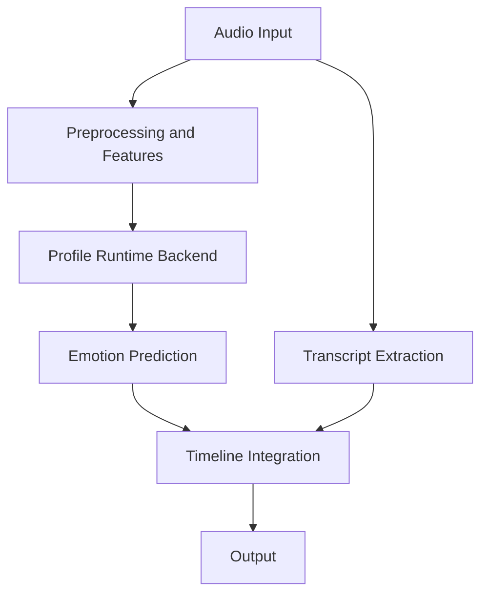
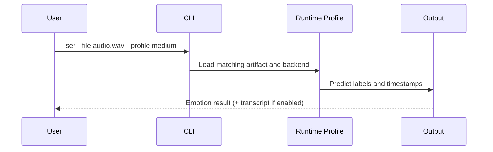

<div align="center">
    
</div>

# Speech Emotion Recognition (SER)
[](https://github.com/jsugg/ser/actions/workflows/ci.yml)
[](https://github.com/jsugg/ser/blob/main/pyproject.toml)
[](https://pypi.org/project/ser/)
[](https://opensource.org/license/mit)

## Project Overview
`ser` is a Python package and CLI for speech emotion recognition from audio.

Core capabilities:
- Emotion prediction from audio files.
- Profile-based inference lanes: `fast` (default), `medium`, `accurate`, `accurate-research`.
- Optional transcript extraction and timeline-style output.

## Pipeline Overview

```mermaid
graph TD;
    A[Audio Input] --> B[Preprocessing and Features];
    B --> C[Profile Runtime Backend];
    C --> D[Emotion Prediction];
    A --> E[Transcript Extraction];
    D --> F[Timeline Integration];
    E --> F;
    F --> G[Output];
```


```mermaid
sequenceDiagram;
    participant U as User
    participant C as CLI
    participant R as Runtime Profile
    participant O as Output
    U->>C: ser --file audio.wav --profile medium
    C->>R: Load matching artifact and backend
    R->>O: Predict labels and timestamps
    O-->>U: Emotion result (+ transcript if enabled)
```

## Quickstart
### 1) Install
From PyPI:
```bash
python -m pip install ser
```

From source:
```bash
git clone https://github.com/jsugg/ser/
cd ser
./scripts/setup_compatible_env.sh
```

Requirements:
- Python `3.12` or `3.13`
- `ffmpeg` on `PATH`

Optional dependency groups:
- `python -m pip install "ser[medium]"` for `medium` and `accurate` profiles.
- `python -m pip install "ser[full]"` for `accurate-research`.
- `ser[full]` is the superset extra and installs dependencies required to run all profiles (`fast`, `medium`, `accurate`, `accurate-research`) on supported platform/version combinations.

### 2) Compatibility Snapshot
- `fast` is the default profile.
- `medium`, `accurate`, and `accurate-research` are opt-in profiles.
- `medium` and `accurate` require `transformers` dependencies (`ser[medium]` or `ser[full]`).
- `accurate-research` requires `ser[full]` and restricted-backend consent.

Darwin Intel policy shorthand:
- `darwin-x86_64-macos13-python3.12` -> full-profile support.
- `darwin-x86_64-macos13-python3.13` -> partial support (fast profile only).

GitHub-hosted workflows use `macos-15` because `macos-13` hosted runners are not available.

### 3) Predict
```bash
ser --file sample.wav
ser --file sample.wav --profile medium
ser --file sample.wav --profile accurate
ser --file sample.wav --profile accurate-research
```

### 4) Train
```bash
ser --train
ser --train --profile medium
ser --train --profile accurate
ser --train --profile accurate-research
```

Profile selection during predict is strict: use an artifact trained for the same profile/backend.
When running from a source checkout without activating an environment, prefix commands with `uv run`.

## Boundary Checks (Contributors)
If your change touches `ser/api.py`, `ser/_internal/api/*`, or `ser/__main__.py`, run:

```bash
make import-lint
uv run pytest -q tests/test_import_lint_policy.py tests/test_api_import_boundary.py tests/test_api.py tests/test_cli.py
```

## Acknowledgments
- **Libraries and Frameworks**: Special thanks to the developers and maintainers of `librosa`, `openai-whisper`, `stable-whisper`, `numpy`, `scikit-learn`, `soundfile`, `tqdm`, and for their invaluable tools that made this project possible.
- **Datasets**: Gratitude to the creators of the RAVDESS and Emo-DB datasets for providing high-quality audio data essential for training the models.
- **Inspirational Sources**: Inspired by [Models-based representations for speech emotion recognition](https://arxiv.org/abs/2311.00394)

## Links
- Architecture guide: [docs/architecture.md](https://github.com/jsugg/ser/blob/main/docs/architecture.md)
- Contributor guide: [CONTRIBUTING.md](https://github.com/jsugg/ser/blob/main/CONTRIBUTING.md)
- Compatibility details: [docs/compatibility-matrix.md](https://github.com/jsugg/ser/blob/main/docs/compatibility-matrix.md)
- Hardware validation workflows: [docs/ci/hardware-validation.md](https://github.com/jsugg/ser/blob/main/docs/ci/hardware-validation.md)
- Architecture decisions index: [docs/adr/README.md](https://github.com/jsugg/ser/blob/main/docs/adr/README.md)
- License: [LICENSE](https://github.com/jsugg/ser/blob/main/LICENSE)
